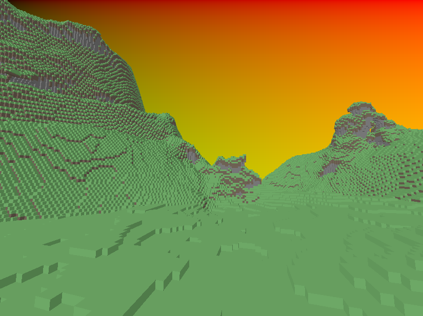

# Kkraft

There comes a time in a programmer's life where they might feel the call. 
The beckoning wears at them, and in their heart they know what must be done. 
In waking and in sleep, they know it has to happen. 
It is now their turn to make a Minecraft clone. 

Kkraft a thing that I made to learn more about rendering and game engine architecture. 
Its visual design is based around Minecraft because Minecraft looks cool.
If n*tch can do it so can I. 

## Features
- Multithreaded terrain generation
- Compute shader voxel ray tracing
- Data-driven rendering system

## Crates
- EKS - My own entity component system
- Krender - My own rendering helper
- Oktree - My own ([not actually my own](https://research.nvidia.com/sites/default/files/pubs/2010-02_Efficient-Sparse-Voxel/laine2010tr1_paper.pdf)) octree data structure
