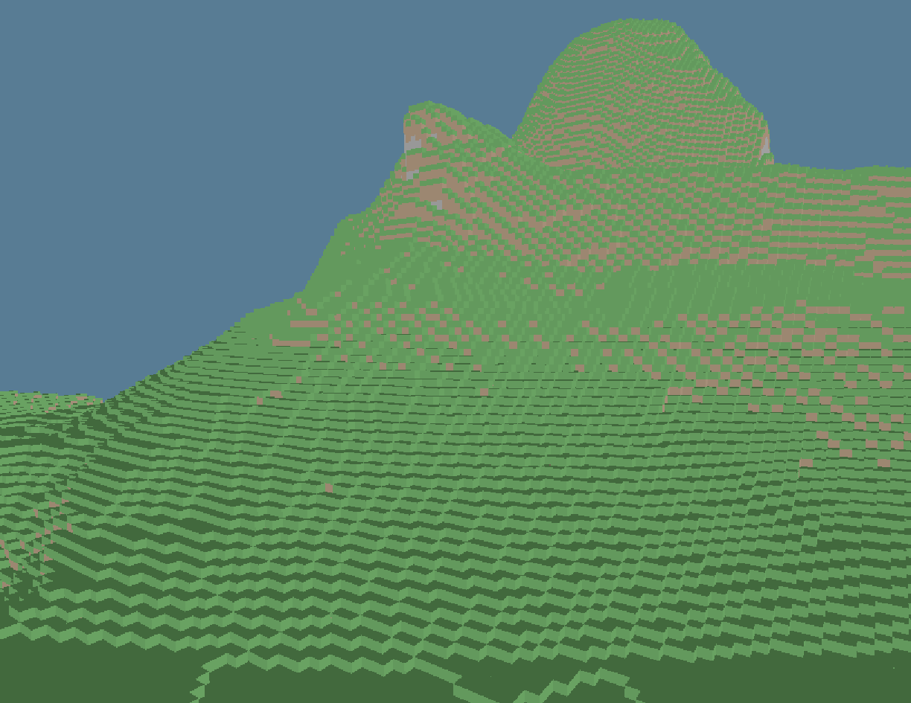

# Kkraft

Kkraft a thing that I made to learn more about rendering and game engine architecture.
Its visual design is based around Minecraft because Minecraft looks cool.
If n*tch can do it so can I.

## Features
* Multithreaded terrain generation
* Compute shader voxel ray tracing
* Data-driven shader system (WIP)
